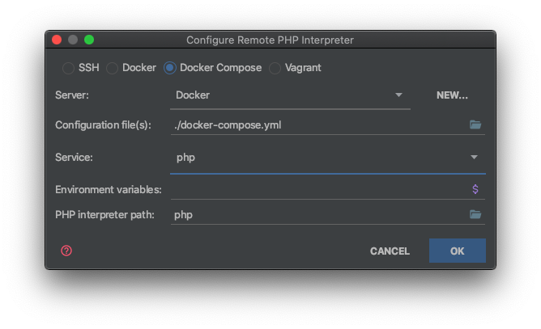
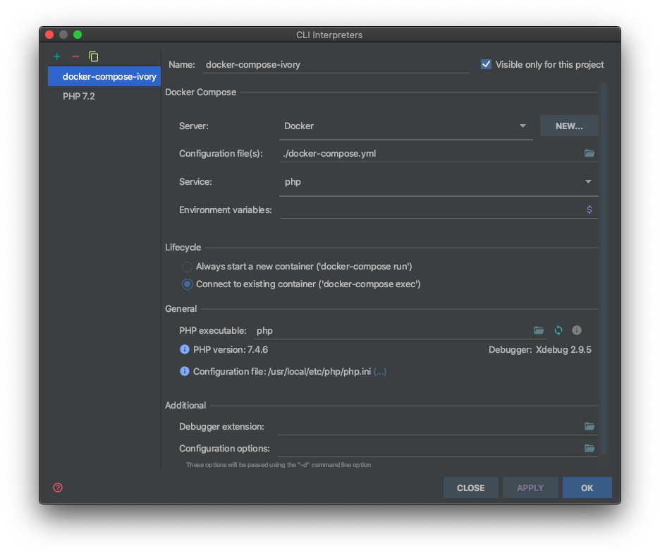
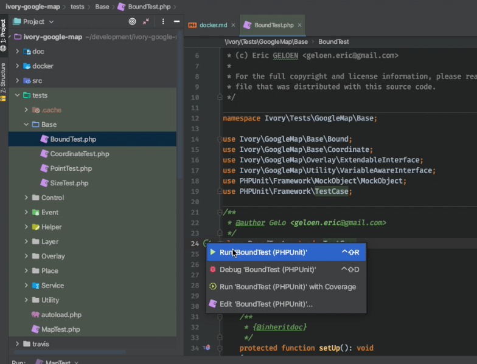

# Development environment

The most easy way to set up the project is to install [Docker](https://www.docker.com) and
[Docker Composer](https://docs.docker.com/compose/) and build the project.

## Configure

``` bash
cp .env.dist .env
cp phpunit.xml.dist phpunit.xml
```
Add proper credentials in `phpunit.xml`

These Endpoints are used:
 - Directions API
 - Distance Matrix API
 - Geocoding API
 - Geolocation API
 - Maps Elevation API
 - Maps Static API
 - Places API
 - Time Zone API


## Build

Once you have configured your environment, you can build the project:

``` bash
docker-compose build
```

## Composer

Install the dependencies via [Composer](https://getcomposer.org/):

``` bash
docker-compose run --rm php composer install
```

## Tests

To start the test suite, you can use:

``` bash
docker-compose up -d
```

To run phpunit:

``` bash
docker exec ivory-google-map_php_1 vendor/bin/phpunit
```

## Tests with PHP Storm integration

Configure PHP Storm for Docker (just create your config):


Create a Docker Compose Remote CLI Interpreter:

Preferences > Language & Frameworks > PHP 




Your Config should look like this:




You are ready to start testing:




At first time it takes some time to build containers


Test results


## Observe Selenium Tests

Get a VNC Client like [VNC Viewer](https://www.realvnc.com/de/connect/download/viewer/)

Start yout Test Environment and connect the viewer to `localhost:5900`

If you get asked for a password it's `secret`